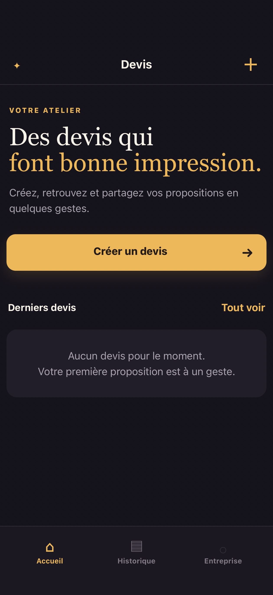
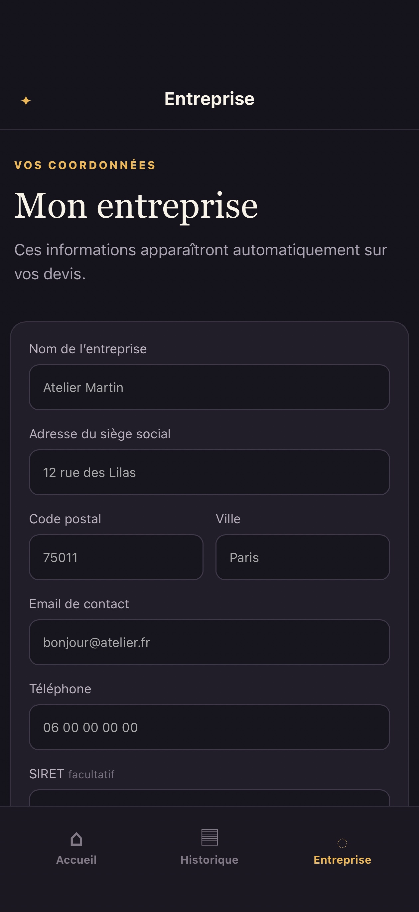
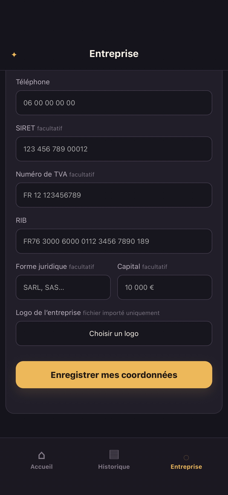
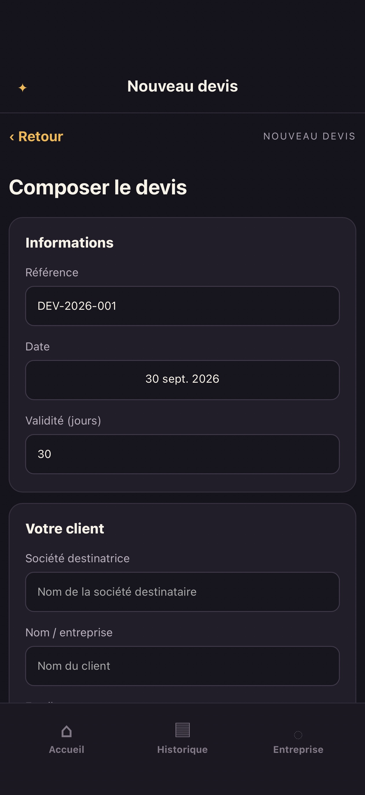
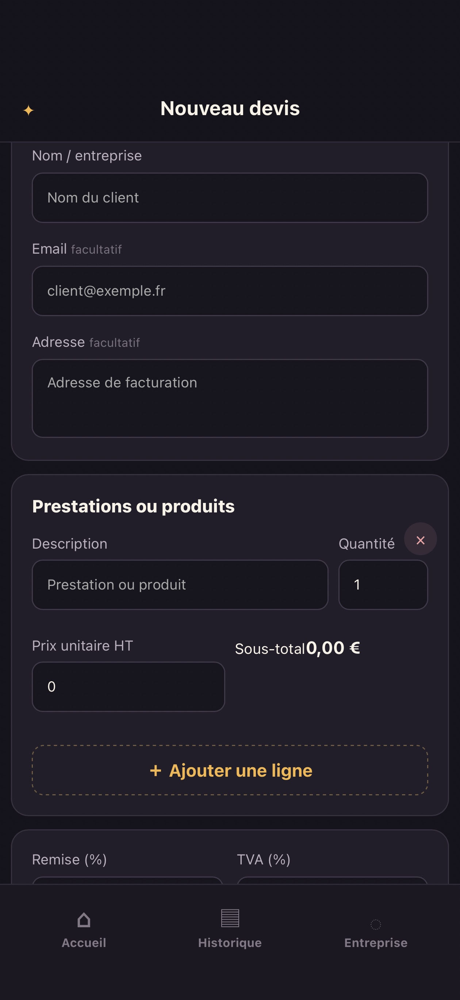
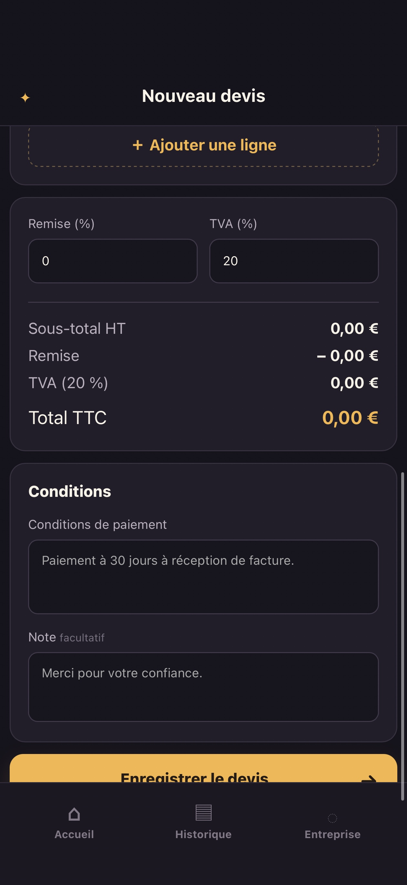

# Créateur de devis

Créer, gérer, prévisualiser, exporter et partager des devis professionnels en PDF avec historique local.

## Ce que cette app demande

- `files.pick`
- `share.present`
- `document.export`

## Ce qu’elle peut contacter

Rien : cette app ne sort pas du téléphone.

## Ce que c’est

Une page HTML, une feuille de style, un script, exécutés localement sur le
téléphone. Pas de dépendance, pas d’outil de construction.

Publiée par Olivier HO-A-CHUCK (@ohoachuck). Relue par personne d’autre.

D’après « Créateur de devis » de Olivier HO-A-CHUCK (https://github.com/ohoachuck/ocb, dossier `createur-de-devis`), sous licence MIT — voir `LICENSE`.

Sous licence MIT — voir `LICENSE`.
