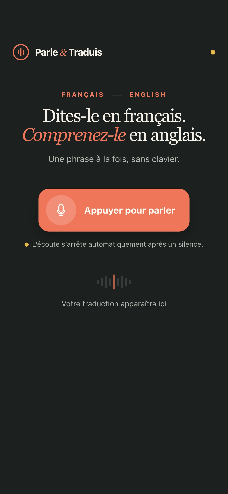
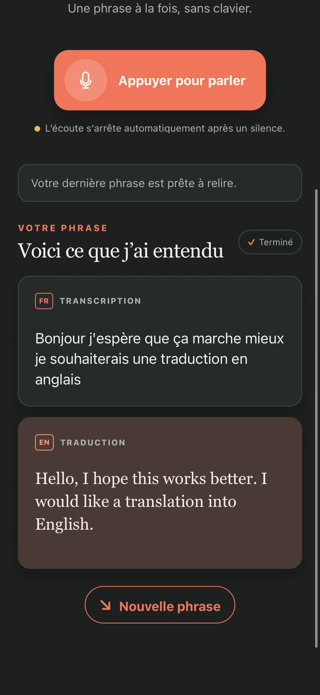
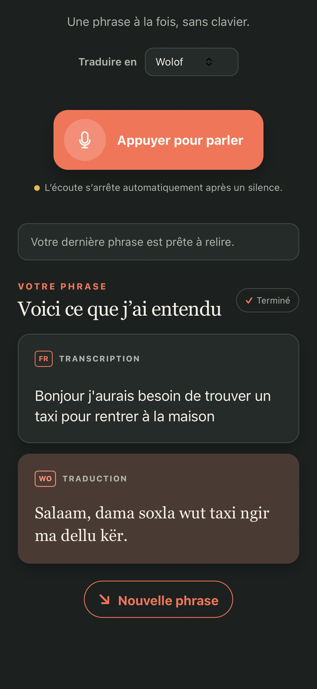

# Parle & Traduis

L’application permet d’écouter une phrase en français, d’afficher sa transcription puis de la traduire dans l’une des cinq langues disponibles(dont le Wolof). Elle permet de répéter l’expérience facilement.

## Ce que cette app demande

- `speech.listen`
- `llm.ask`

## Ce qu’elle peut contacter

Rien : cette app ne sort pas du téléphone.

## Ce que c’est

Une page HTML, une feuille de style, un script, exécutés localement sur le
téléphone. Pas de dépendance, pas d’outil de construction.

Publiée par Olivier HO-A-CHUCK (@ohoachuck). Relue par personne d’autre.

Sous licence MIT — voir `LICENSE`.
