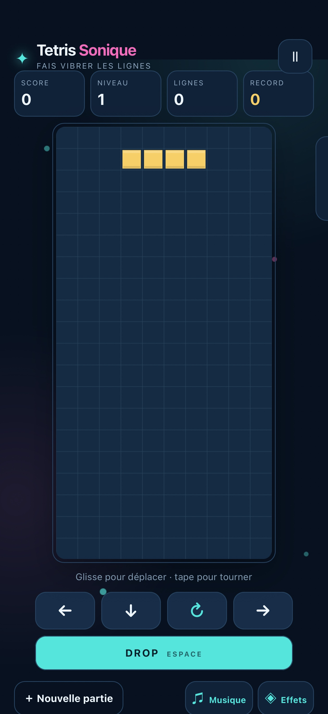
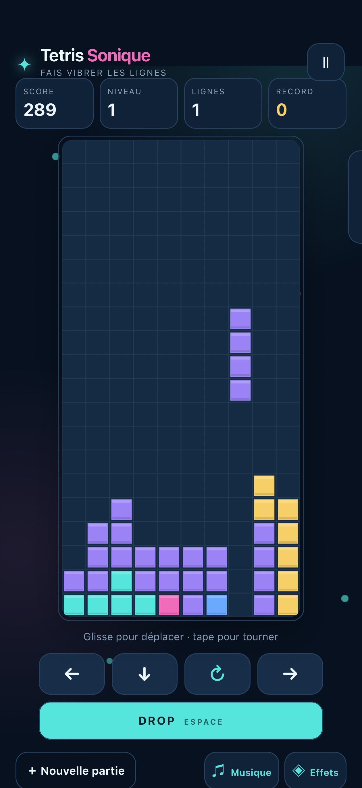
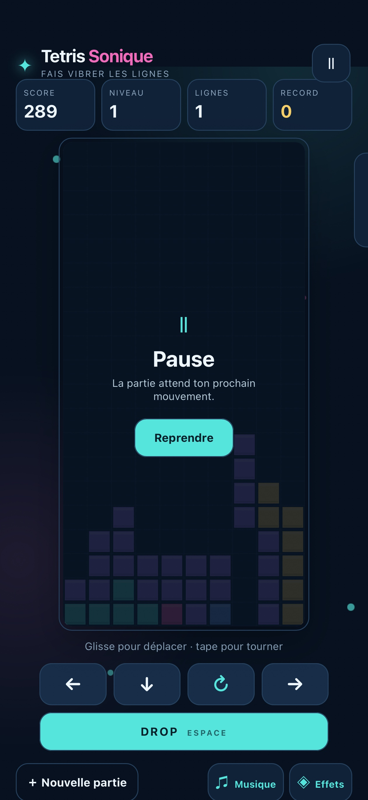

# T’es Triste

Un Tetris classique jouable sur iPhone avec des contrôles tactiles réactifs, du son, une musique désactivable séparément, un arrière-plan animé léger et la sauvegarde automatique de la partie en cours.

## Ce que cette app demande

Rien.

## Ce qu’elle peut contacter

Rien : cette app ne sort pas du téléphone.

## Ce que c’est

Une page HTML, une feuille de style, un script, exécutés localement sur le
téléphone. Pas de dépendance, pas d’outil de construction.

Publiée par Olivier HO-A-CHUCK (@ohoachuck). Relue par personne d’autre.

D’après « Tetris Sonique » de Olivier HO-A-CHUCK (https://github.com/ohoachuck/ocb, dossier `tetris-sonique`), sous licence MIT — voir `LICENSE`.

Sous licence MIT — voir `LICENSE`.
